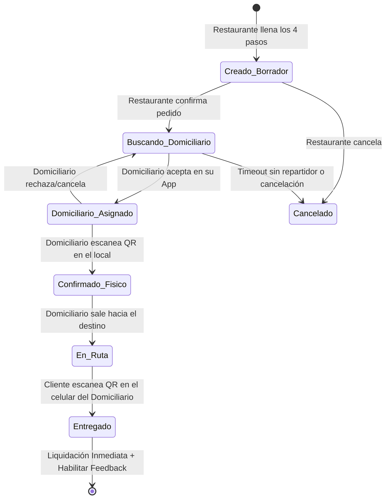
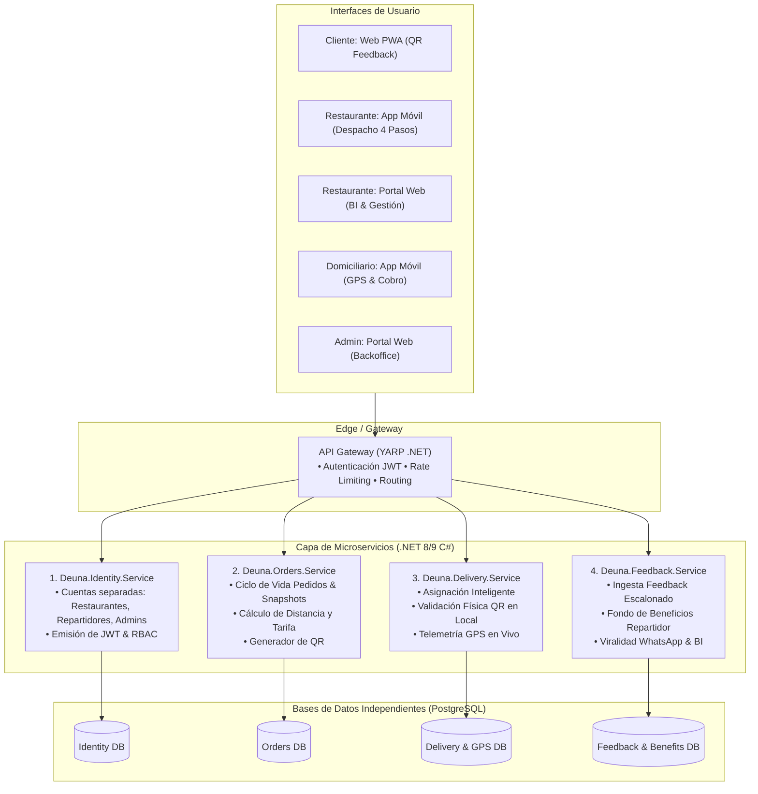

# Especificación Detallada del Sistema: DEUNA DOMICILIOS & FEEDBACK ENGINE
## Plataforma de Crecimiento para Restaurantes, Red Logística & Motor Viral de Feedback

**Ubicación del Proyecto:** `/mnt/c/Users/Andres David/Documents/Proyectos/app-pedidos`  
**Estado:** Documento de Especificación Consolidado (Post Grill-Me - Versión 3.0)

---

## 1. Visión del Negocio y Propuesta de Valor

> *"No somos una empresa de domicilios. Somos una empresa que ayuda a los restaurantes a vender más, fidelizar clientes y mejorar continuamente su negocio. El domicilio es solo el medio; el producto es el crecimiento del restaurante y la estabilidad con beneficios del domiciliario."*

### 1.1. Pilares para el Restaurante (Crecimiento y Fidelización)
1. **Red de Domiciliarios Garantizada:** Cero ventas perdidas por falta de repartidores. El restaurante cocina y vende; la plataforma gestiona la logística.
2. **Despacho Rápido en 4 Pasos (App Móvil):** Creación ágil del pedido con cálculo automático de distancia y tarifa sugerida por DEUNA.
3. **Módulo de Viralidad en WhatsApp:** Clientes satisfechos se convierten en promotores directos compartiendo recomendaciones a sus contactos.
4. **Decisiones Basadas en Datos:** Reportes analíticos con métricas reales de satisfacción por plato, restaurante y repartidor.
5. **Beneficios por Permanencia:** Horas/días bonificados de servicio para aplicar a promociones o margen comercial.
6. **Esquema Financiero Transparente:** Membresía mensual simbólica + retención fija de **$1.500 COP** por domicilio completado (para operación de red y fondo del repartidor).

### 1.2. Pilares para el Domiciliario (Comunidad y Bienestar)
1. **Sin Turnos Obligatorios ni Exigencias de Horario:** Libertad absoluta de conexión; mayor trabajo se traduce en mayores ingresos inmediatos.
2. **Pago Inmediato por Servicio:** Cobro directo al momento de entregar el pedido.
3. **Fondo de Beneficios del Domiciliario:** Cada domicilio aporta a una bolsa para:
   * Cambios de aceite.
   * Mantenimiento preventivo.
   * Convenios de descuento con talleres aliados.
4. **Informe Semanal Automatizado:** Reporte de avance y saldo acumulado del fondo enviado semanalmente.
5. **Reconocimiento y Premios:** Calificación por calidad, puntualidad y presentación con acceso a premios económicos.

---

## 2. Mapa de Actores e Interfaces

```
+----------------------------------------------------------------------------------------------------+
|                                    ECOSISTEMA DE INTERFACES                                         |
+----------------------+----------------------+----------------------+-------------------------------+
| Cliente / Consumidor | Restaurante          | Domiciliario / Moto  | Administrador de Plataforma   |
| (Web Ligera / PWA)   | (App Móvil & Web BI) | (App Móvil Android)  | (Portal Web Backoffice)       |
+----------------------+----------------------+----------------------+-------------------------------+
```

| Actor | Canal / Interfaz | Responsabilidades y Flujos Clave |
| :--- | :--- | :--- |
| **Cliente Final** | Web Ligera / PWA (Acceso vía QR) | • Escaneo de QR en el móvil del repartidor.<br>• **Nivel 1:** Calificación básica ultra rápida en segundos.<br>• **Nivel 2 (Opcional si recomienda):** Feedback adicional granular.<br>• **Nivel 3:** Compartir recomendación prediseñada por WhatsApp. |
| **Restaurante** | **Móvil:** App de Cocina / Despacho<br>**Web:** Portal Administrativo & BI | • **Móvil:** Creación de pedido en 4 pasos, cálculo de tarifa por km, monitoreo de estados en vivo, generación de QR para validación física.<br>• **Web:** Gestión de cartas/precios, reportes de satisfacción/NPS, control de horas bonificadas y saldo contable ($1.500/pedido). |
| **Domiciliario** | App Móvil Android | • Recepción y aceptación de pedidos cercanos.<br>• Confirmación física mediante escaneo de QR en el local.<br>• Navegación y cobro (pedido + valor domicilio).<br>• Visualización de saldo del Fondo de Beneficios y reporte semanal. |
| **Administrador** | Portal Web (Backoffice) | • Auditoría contable del fondo y comisiones.<br>• Moderación de cuentas de restaurantes y repartidores.<br>• Gestión de convenios con talleres mecánicos aliados. |

---

## 3. Flujo Operativo y Máquina de Estados del Pedido



### 3.1. Detalle del Flujo de Creación en 4 Pasos (Mockup Restaurante):
1. **Paso 1 (Cliente):** Datos de quien hizo el pedido y datos de quien recibe (Nombre + Teléfono).
2. **Paso 2 (Entrega):** Dirección exacta, Ciudad/Municipio (ej. Rionegro), Referencias/Indicaciones y visualización en mapa.
3. **Paso 3 (Domicilio & Tarifa):**
   * Cálculo sugerido: Distancia en km, tiempo estimado y valor del domicilio.
   * Quién paga el domicilio: *Paga el cliente* (cobro de comida + envío en destino).
   * Prioridad del pedido: *Normal / Alta*.
   * Observaciones de entrega.
4. **Paso 4 (Confirmar):** Resumen de datos y confirmación del pedido.

---

## 4. Motor de Feedback y Viralidad en WhatsApp (Flujo Escalonado)

```
[QR en Celular del Repartidor] 
             │
             ▼
┌─────────────────────────────────────────────────────────────┐
│ NIVEL 1: CALIFICACIÓN BÁSICA (Ultrarrápida, < 5 segundos)   │
│ • Estrellas Comida (1 a 5 ⭐)                                │
│ • Estrellas Servicio / Repartidor (1 a 5 ⭐)                 │
└─────────────────────────────┬───────────────────────────────┘
                              │
               ¿Calificación Positiva (>= 4⭐)?
               ├── NO ──► Guardar Feedback y Agradecer
               └── SÍ ──► Preguntar: "¿Te gustaría recomendar este restaurante?"
                              │
               ┌──────────────┴──────────────┐
               ▼                             ▼
        [ SÍ, RECOMENDAR ]            [ NO / OMITIR ]
               │                             │
               ▼                             ▼
┌──────────────────────────────┐       ┌────────────────────────┐
│ NIVEL 2: FEEDBACK ADICIONAL  │       │ Guardar Feedback Base  │
│ (Aspectos Granulares)        │       │ y Finalizar            │
│ • Sabor, Temperatura,        │       └────────────────────────┘
│   Presentación, Cantidad     │
│ • Comentario / Foto opcional │
└──────────────┬───────────────┘
               │
               ▼
┌─────────────────────────────────────────────────────────────┐
│ NIVEL 3: COMPARTIR EN WHATSAPP                              │
│ • Botón destacado de un clic                                │
│ • Abre WhatsApp con mensaje prediseñado:                   │
│   "¡Hola! Te recomiendo pedir en [Burger House], la comida  │
│    estuvo excelente. Pide aquí: [Link/Menú]"                │
└─────────────────────────────────────────────────────────────┘
```

---

## 5. Arquitectura de Microservicios Backend (.NET 8/9 C#)

El backend se estructura en 4 microservicios modulares con **Vertical Slice Architecture / Minimal APIs**:



---

## 6. Modelo de Datos Conceptual por Microservicio

### 6.1. Microservicio Identity & Auth
* **`Restaurantes`:** `Id`, `NombreComercial`, `Nit`, `Telefono`, `Direccion`, `Ciudad`, `Latitud`, `Longitud`, `EstadoActivo`, `CreatedAt`.
* **`Repartidores`:** `Id`, `NombreCompleto`, `DocumentoIdentidad`, `Telefono`, `PlacaMoto`, `ModeloMoto`, `FotoPerfilUrl`, `EstadoActivo`, `CalificacionPromedio`, `CreatedAt`.
* **`Administradores`:** `Id`, `Nombre`, `Email`, `PasswordHash`, `Rol`, `CreatedAt`.

### 6.2. Microservicio Orders (Con Snapshots Inmutables)
* **`Pedidos`:**
  * `Id` (UUID/Auto-incremental tipo `PED-00245`).
  * **Datos Restaurante (Snapshot):** `RestauranteId`, `NombreRestaurante`, `DireccionRestaurante`, `CoordenadasRestaurante`.
  * **Datos Cliente (Snapshot):** `NombreClientePide`, `TelefonoClientePide`, `NombreClienteRecibe`, `TelefonoClienteRecibe`.
  * **Datos Entrega (Snapshot):** `DireccionEntrega`, `Ciudad`, `ReferenciaIndicaciones`, `LatitudEntrega`, `LongitudEntrega`.
  * **Tarifas y Finanzas (Snapshot):** `DistanciaKm`, `TiempoEstimadoMin`, `ValorDomicilio`, `QuienPagaDomicilio` (`Cliente` | `Restaurante`), `ValorPendienteDeuna` ($1.500 COP).
  * **Operación:** `Prioridad` (`Normal` | `Alta`), `Observaciones`, `EstadoPedido`, `TokenQrValidacionLocal`, `TokenQrEntregaCliente`, `CreatedAt`, `EntregadoAt`.

### 6.3. Microservicio Delivery
* **`AsignacionesPedido`:** `Id`, `PedidoId`, `RepartidorId`, `FechaAsignacion`, `FechaLlegadaLocal`, `FechaSalidaRuta`, `FechaEntrega`, `EstadoAsignacion`.
* **`TrackingRepartidor`:** `RepartidorId`, `UltimaLatitud`, `UltimaLongitud`, `UltimaActualizacion`.

### 6.4. Microservicio Feedback & Benefits
* **`Calificaciones`:** `Id`, `PedidoId`, `RestauranteId`, `RepartidorId`, `RatingGeneralComida` (1-5), `RatingServicioRepartidor` (1-5), `DeseaRecomendar` (Bool), `NpsScore`, `CreatedAt`.
* **`FeedbackDetallado`:** `Id`, `CalificacionId`, `RatingSabor`, `RatingTemperatura`, `RatingPresentacion`, `RatingCantidad`, `RatingEmpaque`, `Comentario`, `RecomendacionEnviadaWhatsapp` (Bool).
* **`FondoBeneficiosRepartidor`:** `RepartidorId`, `SaldoAcumuladoFondo`, `TotalServiciosRealizados`, `TotalAportesAcumulados`.
* **`TransaccionesFondo`:** `Id`, `RepartidorId`, `PedidoId`, `MontoAporte`, `Tipo` (`IngresoPorEntrega` | `CanjeTallerAliado`), `Concepto`, `CreatedAt`.
* **`ConveniosTalleres`:** `Id`, `NombreTaller`, `Direccion`, `TipoServicio` (Aceite, Mantenimiento, Llantas), `DescuentoOpcional`.
