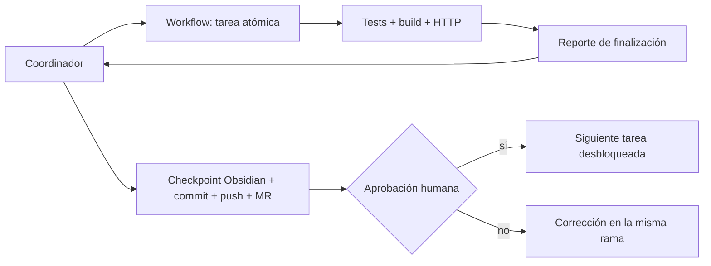

# Plan de implementación coordinada

Fecha: 2026-09-22  
Estado: preparado; ejecución detenida a la espera de aprobación

## Punto de partida

La rama `main` contiene los entregables de infraestructura (TASK-001 a TASK-004) y de Identity (TASK-101 a TASK-103). El siguiente trabajo ejecutable es TASK-201. La fuente de verdad funcional es el Spec-Kit de Obsidian; este documento convierte sus diez fases en entregas pequeñas, comprobables y bloqueadas por dependencias.

## Reglas para todos los workflows

- Cada workflow crea una rama `feature/<task-id>-<descripcion>` desde `main` actualizado y trabaja únicamente en los archivos de su tarea.
- TDD obligatorio: commit de prueba que falla, commit de implementación mínima y refactorización solo con pruebas verdes.
- Cada endpoint incorpora su ejemplo `.http`; las clases nuevas de negocio alcanzan al menos 80% de cobertura, y los flujos P1 tienen integración/E2E.
- Se respetan VSA/Minimal APIs, database-per-service, `Result<T>`, JWT por rol y eventos MassTransit; no se hacen joins ni SQL entre servicios.
- Un workflow informa al coordinador: task ID, SHA, tests/build ejecutados, cobertura, archivos `.http` y riesgos. El coordinador registra el checkpoint, hace push y abre/actualiza el MR. No se inicia el sucesor hasta recibir aprobación humana del MR.

## Flujo de control

## Backlog por fase y workflow

| Fase | Orden de ejecución | Workflow / entregables | Puerta de salida |
|---|---|---|---|
| 1. Infraestructura | Cerrada; solo deuda | `INFRA-401`: GitHub Actions: build, unit, integration y análisis; ajustar imágenes a .NET 8 LTS si la auditoría revela .NET 10 | pipeline verde en PR |
| 2. Identity | Cerrada; solo hardening | `IAM-104`: auditoría de contratos JWT, refresh y pruebas de integración/Testcontainers; `IAM-105`: publicación de eventos `UsuarioRegistrado`/`UsuarioActualizado` para réplicas | compatibilidad de claims y eventos demostrada |
| 3. Orders | `TASK-201 → 202-A → 202-B → 202-C → 203 → 204 → 205` | `TASK-201`: entidades, `OrdersDbContext`, PostGIS, migración e índice GiST; `202-A`: DTO/validator y cálculo de tarifa; `202-B`: alta transaccional y subtablas; `202-C`: endpoint, auth RESTAURANT y HTTP; `203`: QR y código visible; `204`: evento `PedidoCreado`/outbox o publicación confiable; `205`: integración PostGIS/MassTransit y E2E | pedido persistido, tarifa, QR y evento verificados |
| 4. Delivery | `TASK-301 → 302-A → 302-B → 303 → 304 → 305` | `TASK-301`: modelo/migración de asignaciones, réplica y consumer `PedidoCreado`; `302-A`: disponibles/aceptar pedido con concurrencia; `302-B`: QR local e inicio de ruta; `303`: Redis GEOADD, TTL y actualización GPS; `304`: tracking y QR de entrega; `305`: eventos `PedidoAsignado`, `PedidoEnRuta`, `PedidoEntregado` y E2E | ciclo de asignación a entrega rastreable |
| 5. Feedback | `TASK-401 → 402 → 403 → 404` | `TASK-401`: modelo/migración, consumer `PedidoEntregado` y SubmitBasicFeedback; `402`: feedback detallado y regla nivel 2; `403`: fondo de beneficios y transacción por entrega; `404`: enlace/registro WhatsApp y pruebas de integración | feedback único y fondo auditables |
| 6. Portal web | `WEB-501 → 502 → 503 → 504` | setup Next.js 15/Tailwind/autenticación; dashboard restaurante; dashboard admin/finanzas; gráficos, CSV y pruebas UI | métricas P2 y exportación comprobadas |
| 7. App móvil | `MOB-601 → 602 → 603 → 604` | setup Expo; flujo restaurante de 4 pasos; flujo repartidor QR/pedidos; GPS background y Detox | flujos móviles P1 E2E |
| 8. PWA feedback | `PWA-701 → 702 → 703` | SSG/PWA; flujo escalonado; accesibilidad, rendimiento Lighthouse ≥90 y pruebas | carga y feedback móvil validados |
| 9. Observabilidad | `OBS-801 → 802 → 803` | Serilog correlacionado; OpenTelemetry/Jaeger; Prometheus/Grafana y alertas iniciales | trazas y métricas cross-service visibles |
| 10. Validación y despliegue | `REL-901 → 902 → 903 → 904` | k6; staging smoke E2E; manifiestos/despliegue; Swagger y documentación final | SLOs, smoke y rollback verificados |

## Dependencias críticas

`TASK-201 → TASK-202/203/204/205 → TASK-301…305 → TASK-401…404 → WEB-501…504 → MOB-601…604 → PWA-701…703 → OBS-801…803 → REL-901…904`.

`INFRA-401`, `IAM-104` e `IAM-105` pueden ejecutarse como endurecimiento antes de `TASK-201`, pero no modifican sus contratos sin un ADR y aprobación explícita.

## Primera asignación propuesta

Al aprobar el próximo ciclo, se activa únicamente `TASK-201`. Su workflow debe entregar modelos normalizados, extensión PostGIS, índice GiST, migración reproducible, pruebas unitarias/integración y `Deuna.Orders.Service/Examples/orders-schema.http` si procede. La aprobación de su MR desbloquea `202-A`; ningún workflow posterior se inicia anticipadamente.
